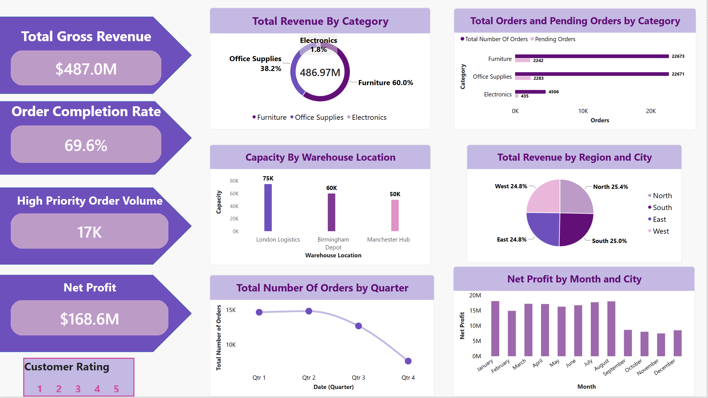

# operations-and-logistics-powerbi-project

## Project Overview
This project is a Power BI Dashboard that processes and analyses over 50,000 company order records. The main goal of the report is to take raw shipping and sales files and turn them into a clear view for management—specifically tracking exact profits, open warehouse space, and monthly order counts.

---
# Dashboard Preview

---

## Data Structure & Table Links
The tables are set up using a clean Star Schema layout. This splits the main sales records from the detail lists so that the computer runs calculations much faster.

* Main Table: operations_data (Contains quantities, costs, shipping days, and cities).
* Detail Tables: Product Dim and Location Dim linked by ID numbers.

---

## Dashboard Numbers & Charts Breakdown

### The Top KPI Cards
* Total Gross Revenue ($487.0M): Calculated by multiplying how many items were ordered by the retail prices found in the Product Dim table using the RELATED command.
* Order Completion Rate (69.6%): Shows the percentage of orders fully finished by dividing completed shipments against the total number of unique order sheets.
* High Priority Order Volume (17K): Built by applying the CALCULATE function to the Total Orders measure, filtering the screen to isolate only the active, high-priority orders in the system.
* Net Profit ($168.6M): Built using DAX Variables (VAR / RETURN) to calculate sales and costs separately in the computer's memory. This keeps the dashboard from slowing down.

### The 6 Main Charts
1. Total Revenue By Category (Donut Chart): Shows sales shares by product group. The detail labels are placed on the outside to ensure the low-volume Electronics slice (1.8%) stays fully readable next to Furniture (60.0%) and Office Supplies (38.2%).
2. Capacity By Warehouse Location (Column Chart): Shows exactly how much physical storage space is used at the major hubs (London: 75K, Birmingham: 60K, Manchester: 50K) listed in the Location Dim table.
3. Total Number Of Orders by Quarter (Line Chart): Tracks the volume of orders across the year, showing a major drop-off by Q4.
4. Total Orders and Pending Orders by Category (Stacked Bar Chart): Compares the total number of orders against the orders still waiting to be shipped for each category.
5. Total Revenue by Region and City (Pie Chart): Shows that incoming sales are evenly split across the four regions at 25% each. It allows managers to click a region to see individual cities.
6. Net Profit by Month and City (Column Chart): Tracks monthly profit generation over the year, revealing a big drop in company earnings near the end of the year.

---

## Two Main Recommendations to Improve the Business

Based on what the final charts show, I recommend these two actions to management:

### 1. Fix the Second-Half Drop in Order Volumes
* The Problem: The Net Profit by Month chart shows that company earnings drop off a cliff starting in September. By cross-referencing this with the Total Number Of Orders by Quarter line chart, the root cause is clear: the number of customer orders drops sharply in Q3 and falls to seasonal lows in Q4. The lower profits are driven directly by a drop in demand, not a rise in costs.
* The Action: The sales and marketing teams need to look into why order volume collapses during the second half of the year. Management should introduce targeted promotions, holiday bundles, or customer loyalty discounts in Q3 and Q4 to reverse this downward trend and keep order volume stable year-round.

### 2. Stop Relying So Heavily on Just One Category
* The Problem: The Revenue by Category wheel shows that the business relies almost entirely on Furniture (60.0%) and Office Supplies (38.2%) for its money. Electronics is basically ignored at just 1.8%.
* The Action: If the furniture market slows down or supply chains freeze, the company will lose most of its income. Management should shift some marketing money and inventory focus into growing the Electronics category so the business is safer and less dependent on a single product type.

---

## Tech Stack & Skills Used
* Data Cleaning: Power Query, removing hidden text spaces, splitting combined columns, and rounding off long decimal tails so the formatting is clean.
* Data Modelling: Star Schema design using Product Dim and Location Dim, mapping ID keys, and setting relationships to a single direction.
* Formulas and Code: Power BI DAX formulas using functions like SUMX, CALCULATE, RELATED, and performance variables (VAR / RETURN).
